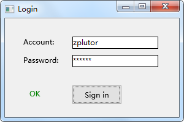

# 创建一个简单的程序

本文通过创建一个简单的程序，来演示zaf的基本用法。这个程序是一个虚拟的登录程序，如下图所示：



该程序的完整代码位于`example\login`文件夹中，可以打开该项目直接构建和运行。

## 初始化zaf
首先，我们需要初始化zaf并让它运行起来。显然，这些工作都需要在程序入口点`WinMain`函数中进行，如下所示：
```cpp
int WINAPI WinMain(HINSTANCE hInstance, HINSTANCE hPrevInstance, LPSTR lpCmdLine, int nCmdShow) {

    zaf::Application& application = zaf::GetApplication();

    //Initialize the application.
    std::error_code error_code;
    application.Initialize(error_code);

    //Exit if the initialization is failed.
    if (! zaf::IsSucceeded(error_code)) {
        return error_code.value();
    }

    //Register the begin run event, do something when the event triggers.
    application.GetBeginRunEvent().AddListener(OnBeginRun);

    //Begin to run.
    application.Run();
    return 0;
}
```

在上面的代码中，我们通过`zaf::GetApplication`获取`zaf::Application`的单例，然后调用它的`Initialize`方法进行初始化。紧接着检查一下初始化是否成功，如果不成功则退出程序。

在zaf中，错误信息使用`std::error_code`来表示，并且以输出参数的形式来返回。检查是否成功使用`zaf::IsSucceeded`函数。

初始化成功后，我们注册`zaf::Application`的BeignRun事件。当zaf一开始运行的时候就会触发该事件。与之对应的是EndRun事件，当zaf结束运行的时候就会触发该事件。我们应该在BeginRun事件中执行我们自己的初始化工作（例如创建并显示主窗口），并且在EndRun事件中执行清理工作。

最后，我们调用`Run`方法让zaf运行起来。该方法不会立即返回，只有调用了`zaf::Application`的`Terminate`方法或者程序的主窗口关闭之后才会返回。当`Run`方法返回的时候也就意味着程序结束了。

## 创建主窗口
下面看看`OnBeginRun`函数的实现，我们在这个函数中创建并显示主窗口：
```cpp
static void OnBeginRun(zaf::Application& application) {

    //Create a main window.
    std::shared_ptr<zaf::Window> main_window = CreateMainWindow();

    //Set this window as the main window of the application.
    application.SetMainWindow(main_window);

    //Show the window.
    main_window->Show();
}
```

实现很简单，不需要赘述。值得注意的是，只有通过`SetMainWindow`设置的窗口才是真正的主窗口。正如上文所说，当这个窗口关闭之后，zaf会结束运行，程序也会随之退出。

接下来看看`CreateMainWindow`的实现：
```cpp
static std::shared_ptr<zaf::Window> CreateMainWindow() {

    //Create a window and set its properties.
    std::shared_ptr<zaf::Window> main_window = zaf::Create<zaf::Window>();
    main_window->SetTitle(L"Login");
    main_window->SetSize(zaf::Size(300, 200));

    //Create controls and add them to the root control of window.
    std::vector<std::shared_ptr<zaf::Control>> controls = CreateControls();

    for (const auto& each_control : controls) {
        main_window->GetRootControl()->AddChild(each_control);
    }

    return main_window;
}
```

如你所见，创建窗口使用的是`zaf::Create`函数。在zaf中，所有窗口和控件都需要用这个函数来创建，这是一个强制性的约束，如果不这么做，窗口或控件的表现会出现异常。

每个窗口默认都有一个根控件，通过`GetRootControl`方法可以获取该控件。只要调用`AddChild`方法往根控件中添加子控件，即可让这些子控件显示在窗口中。

## 创建控件
控件的创建方式与窗口一致，如下所示：
```cpp
static std::vector<std::shared_ptr<zaf::Control>> CreateControls() {

    //Account label.
    auto account_label = zaf::Create<zaf::Label>();
    account_label->SetText(L"Account: ");
    account_label->SetRect(zaf::Rect(30, 30, 80, 20));

    //Account text box.
    auto account_text_box = zaf::Create<zaf::TextBox>();
    account_text_box->SetRect(zaf::Rect(110, 30, 140, 20));

    //Password label.
    auto password_label = zaf::Create<zaf::Label>();
    password_label->SetText(L"Password: ");
    password_label->SetRect(zaf::Rect(30, 60, 80, 20));

    //Password text box.
    auto password_text_box = zaf::Create<zaf::TextBox>();
    password_text_box->SetUsePasswordCharacter(true);
    password_text_box->SetPasswordCharacter(L'*');
    password_text_box->SetRect(zaf::Rect(110, 60, 140, 20));

    //Sign in result label.
    auto sign_in_result_label = zaf::Create<zaf::Label>();
    sign_in_result_label->SetRect(zaf::Rect(40, 115, 80, 30));

    //Sign in button.
    auto sign_in_button = zaf::Create<zaf::Button>();
    sign_in_button->SetText(L"Sign in");
    sign_in_button->SetRect(zaf::Rect(110, 110, 80, 30));
    sign_in_button->GetClickEvent().AddListener(std::bind(
        OnSignInClick, 
        account_text_box, 
        password_text_box, 
        sign_in_result_label));

    //Return controls.
    return {
        account_label,
        account_text_box,
        password_label,
        password_text_box,
        sign_in_result_label,
        sign_in_button,
    };
}
```

有必要再次强调，zaf的窗口和控件都需要使用`zaf::Create`方法来创建。

在这个例子中，所有控件都使用手动布局。我们通过`SetRect`方法来设置每个控件具体的位置和大小。

## 响应按钮点击事件
最后一步是要响应登录按钮的点击事件。在上面的代码中已经看到，`zaf::Button`有一个Click事件，我们把`OnSignInClick`方法注册到该事件中。从这里也可以看出，zaf的事件注册方式都是一致的。

下面是`OnSignInClick`的实现：
```cpp
static void OnSignInClick(
    const std::shared_ptr<zaf::TextBox>& account_text_box,
    const std::shared_ptr<zaf::TextBox>& password_text_box,
    const std::shared_ptr<zaf::Label>& sign_in_result_label) {

    if (account_text_box->GetText() == L"zplutor" &&
        password_text_box->GetText() == L"123456") {

        sign_in_result_label->SetDefaultTextColor(zaf::Color::Green);
        sign_in_result_label->SetText(L"OK");
    }
    else {

        sign_in_result_label->SetDefaultTextColor(zaf::Color::Red);
        sign_in_result_label->SetText(L"Wrong");
    }
}
```

上面的代码先检查账号和密码文本框的内容是否正确，然后再设置标签的颜色和文本。 
